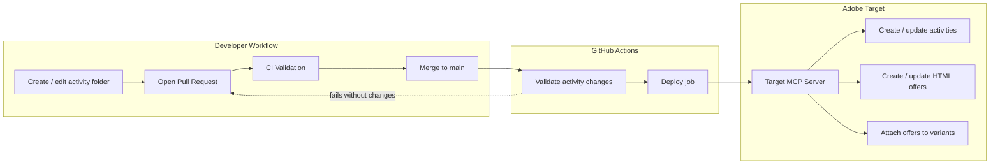

# Adobe Target Activity Deploy

**GitOps pipeline for Adobe Target activities and HTML offers.**

Manage Adobe Target Experience Targeting (XT) and A/B Test activities as version-controlled code. Each activity lives in its own folder with declarative configuration. On merge to `main`, validated changes are deployed automatically to Adobe Target through the [Adobe Target MCP server](https://targetmcp.adobe.io/mcp).

---

## Table of Contents

- [Overview](#overview)
- [Features](#features)
- [Architecture](#architecture)
- [Prerequisites](#prerequisites)
- [Quick Start](#quick-start)
- [Project Structure](#project-structure)
- [Activity Folder Convention](#activity-folder-convention)
- [Configuration Reference](#configuration-reference)
- [Deploy Modes](#deploy-modes)
- [GitHub Actions Setup](#github-actions-setup)
- [Local Development](#local-development)
- [Validation Rules](#validation-rules)
- [Troubleshooting](#troubleshooting)
- [Security](#security)

---

## Overview

Adobe Target Activity Deploy bridges your Git repository and Adobe Target. Marketers and developers author HTML offer content in activity folders, open pull requests for review, and merge to `main` to publish changes to Target.

The pipeline:

1. **Detects** create or update changes in activity folders
2. **Validates** HTML, CSS, JavaScript, and activity metadata
3. **Deploys** activities and offers via Adobe Target MCP tools
4. **Names** resources consistently with a GitHub-attributed prefix

Activities are **not auto-activated** by default. Content is pushed to Adobe Target in a saved state so teams can review and activate manually in the Target UI.

---

## Features

| Capability | Description |
|------------|-------------|
| **Activity-as-code** | Each Target activity is a self-contained folder with `activity-info.json` and HTML offer files |
| **Create & update** | Deploy brand-new activities or update existing offers in the same workflow |
| **Auto-discovery** | No per-activity registration in global config — folders are discovered automatically |
| **CI gate** | Pull requests fail unless they include a valid activity create or update |
| **HTML validation** | HTML structure, embedded CSS/JS syntax, and Prettier formatting checks |
| **Duplicate protection** | Optional checks against existing activity and offer names in Adobe Target |
| **Token refresh** | Automatic IMS token refresh on 401 using client credentials |
| **Naming convention** | Deployed names prefixed with `[GitHub][username]` for traceability |

---

## Architecture



### Deploy flow by mode

**Create** — triggered when a new `activity-info.json` is added:

```
activity-info.json (new) → create_xt_activity / create_ab_activity
                        → create_target_offer
                        → update_variant_offer
```

**Update** — triggered when files change inside an existing activity folder:

```
activity-info.json (existing IDs) → update_target_offer
```

---

## Prerequisites

| Requirement | Details |
|-------------|---------|
| **Adobe Target** | Access to an Adobe Target property with MCP enabled |
| **Adobe IMS credentials** | Client ID, client secret, and access token with Target SDK scope |
| **GitHub repository** | With Actions enabled and a `production` environment for deploy |
| **Python 3.12+** | For local scripts and validation |
| **Node.js 20+** | For HTML Prettier checks and JavaScript syntax validation |

---

## Quick Start

### 1. Clone and configure

```bash
git clone https://github.com/<your-org>/<your-repo>.git
cd <your-repo>
```

Update `deploy.config.json` with your deploy username:

```json
{
  "deploy_username": "your-github-username"
}
```

### 2. Add GitHub Secrets

In **Settings → Secrets and variables → Actions**, add:

| Secret | Description |
|--------|-------------|
| `ADOBE_ACCESS_TOKEN` | Adobe IMS bearer token for Target MCP |
| `ADOBE_CLIENT_ID` | Adobe Developer Console client ID |
| `ADOBE_CLIENT_SECRET` | Adobe Developer Console client secret |

### 3. Create your first activity

```bash
python scripts/create_activity.py summer_promo_xt_test "Summer Promo XT Test"
```

This scaffolds a folder from `_activity_template/`:

```
summer_promo_xt_test/
├── activity-info.json
└── summer_promo_xt_test_exp_a.html
```

Edit the HTML offer, commit, and open a pull request.

### 4. Merge to deploy

After CI passes, merge to `main`. The deploy job publishes the activity and offer to Adobe Target with names like:

```
[GitHub][your-github-username] Summer Promo XT Test
[GitHub][your-github-username] Summer Promo XT Test - Variant A
```

### 5. Save IDs for future updates

After the first successful deploy, copy the returned `activity_id` and `offer_id` from the GitHub Actions log into `activity-info.json`:

```json
{
  "activity_id": 123456,
  "variants": [
    {
      "offer_id": 789012
    }
  ]
}
```

Commit those IDs so subsequent HTML edits deploy in **update** mode.

---

## Project Structure

```
.
├── _activity_template/          # Scaffold template (excluded from deploy)
│   ├── activity-info.json
│   └── your_activity_name_exp_a.html
├── <activity_folder>/           # One folder per Target activity
│   ├── activity-info.json       # Activity metadata and variant config
│   └── <folder>_exp_a.html      # HTML offer content
├── deploy.config.json           # Global deploy and discovery settings
├── .github/workflows/deploy.yml # CI validation and production deploy
├── scripts/
│   ├── activity_discovery.py    # Git-based create/update detection
│   ├── check_new_activity_folder.py  # PR gate
│   ├── validate_activity_code.py     # HTML/CSS/JS validation
│   ├── deploy_to_target_mcp.py       # MCP deploy orchestration
│   ├── create_activity.py            # Activity scaffolding CLI
│   └── pre_push_check.py             # Optional local pre-push helper
├── requirements.txt             # Python dependencies
└── package.json                 # Prettier for HTML formatting
```

---

## Activity Folder Convention

Each deployable activity follows this pattern:

```
my_campaign_xt_test/
├── activity-info.json
└── my_campaign_xt_test_exp_a.html
```

### `activity-info.json` schema

| Field | Required | Description |
|-------|----------|-------------|
| `activity_id` | For updates | Adobe Target activity ID. Use `0` or omit for new activities |
| `activity_name` | Yes | Display name in Adobe Target (prefix applied on deploy) |
| `activity_description` | No | Activity description sent to Target |
| `activity_type` | Yes | `XT`, `AB`, or `ABT` |
| `activity_location` | No | Target location name (default: `home`) |
| `activity_status` | No | `active`, `inactive`, `paused`, `draft`, `saved` |
| `activity_start_date` | No | ISO date (`YYYY-MM-DD`) |
| `activity_end_date` | No | ISO date (`YYYY-MM-DD`) |
| `variants` | Yes | Array of variant/offer definitions |
| `actions` | No | Per-activity overrides for deploy behavior |

### Variant object

| Field | Required | Description |
|-------|----------|-------------|
| `variant` | Yes | Variant identifier (e.g. `variant_a`) |
| `html_file` | Yes | HTML offer filename in the activity folder |
| `offer_name` | Yes | Offer name in Adobe Target (prefix applied on deploy) |
| `offer_id` | For updates | Adobe Target offer ID. `null` for new offers |
| `mode` | No | `create_or_update` (default) or `update` |

### Example

```json
{
  "activity_id": 0,
  "activity_name": "Home Page Banner XT Test",
  "activity_description": "Hero banner personalization on the home page",
  "activity_status": "active",
  "activity_start_date": "2026-01-01",
  "activity_end_date": "2026-12-31",
  "activity_type": "XT",
  "activity_location": "home",
  "activity_target": "users",
  "variants": [
    {
      "variant": "variant_a",
      "html_file": "home_page_banner_xt_test_exp_a.html",
      "offer_name": "Home Page Banner XT Test - Variant A",
      "offer_id": null,
      "mode": "create_or_update"
    }
  ],
  "actions": {
    "push_offer": true,
    "attach_offer_to_variant": true,
    "sync_activity_state": false,
    "create_activity_if_missing": true
  }
}
```

### HTML offer files

- Plain HTML fragments or full documents
- Embedded `<style>` and `<script>` blocks are supported and validated
- File naming convention: `<folder_name>_exp_<variant>.html`

---

## Configuration Reference

Global settings live in `deploy.config.json`. Activity-specific settings live in each folder's `activity-info.json`.

### `deploy.config.json`

| Key | Default | Description |
|-----|---------|-------------|
| `mcp_server_url` | `https://targetmcp.adobe.io/mcp` | Adobe Target MCP endpoint |
| `discovery.deploy_modes` | `["create", "update"]` | Allowed deploy modes |
| `discovery.exclude_dirs` | `.github`, `scripts`, `_activity_template`, … | Folders skipped during discovery |
| `default_actions.push_offer` | `true` | Create or update HTML offers |
| `default_actions.attach_offer_to_variant` | `true` | Attach offers to activity variants |
| `default_actions.sync_activity_state` | `false` | Sync activity state to Target (disabled by default) |
| `default_actions.create_activity_if_missing` | `true` | Create activity when `activity_id` is `0` |
| `deploy_name_prefix` | `"[GitHub]"` | Prefix for deployed activity and offer names |
| `deploy_username` | — | Fallback username when `GITHUB_ACTOR` is unavailable |
| `validation.check_duplicate_activity_name` | `true` | Fail if activity name already exists in Target |
| `validation.check_duplicate_offer_name` | `true` | Fail if offer name already exists in Target |

### Per-activity `actions` overrides

Any key under `default_actions` can be overridden per activity:

```json
{
  "actions": {
    "sync_activity_state": false,
    "create_activity_if_missing": true
  }
}
```

---

## Deploy Modes

| Mode | Trigger | Requirements | MCP actions |
|------|---------|--------------|-------------|
| **Create** | New `activity-info.json` added in merge | `activity_id: 0` | `create_xt_activity` / `create_ab_activity`, `create_target_offer`, `update_variant_offer` |
| **Update** | Any file changed in an existing activity folder | `activity_id` and `offer_id` set | `update_target_offer` |

### What gets deployed on merge

| Change | Deployed? |
|--------|-----------|
| New activity folder with `activity-info.json` | Yes (create) |
| HTML or JSON edit in existing activity folder | Yes (update, if IDs are set) |
| Changes only in `scripts/`, `deploy.config.json`, or docs | No — CI fails |
| Merge with no activity changes | No — CI fails |

---

## GitHub Actions Setup

Workflow: `.github/workflows/deploy.yml`

### Jobs

| Job | Trigger | Purpose |
|-----|---------|---------|
| **Validate activity changes** | Pull request and push to `main` | Ensures merge includes activity changes; validates code quality |
| **Deploy to Adobe Target MCP** | Push to `main` only | Publishes validated changes to Adobe Target |

### Recommended branch protection

On `main`, require the **Validate activity changes** status check before merging. This prevents merges that would skip deploy or fail validation.

### Environment

The deploy job uses the GitHub `production` environment. Configure required reviewers or deployment rules as needed for your organization.

### Environment variables (deploy job)

| Variable | Source | Description |
|----------|--------|-------------|
| `ADOBE_ACCESS_TOKEN` | Secret | Primary authentication token |
| `ADOBE_CLIENT_ID` | Secret | Used for token refresh on 401 |
| `ADOBE_CLIENT_SECRET` | Secret | Used for token refresh on 401 |
| `GITHUB_BEFORE_SHA` | Workflow | Previous commit for change detection |
| `GITHUB_SHA` | Workflow | Current commit for change detection |
| `GITHUB_ACTOR` | Workflow | GitHub username for name prefix |
| `DEPLOY_USERNAME` | Workflow | Fallback username for name prefix |

---

## Local Development

### Install dependencies

```bash
pip install -r requirements.txt
npm install
```

### Scaffold a new activity

```bash
python scripts/create_activity.py <folder_name> "<Activity Display Name>"
```

Example:

```bash
python scripts/create_activity.py checkout_banner_xt_test "Checkout Banner XT Test"
```

### Validate locally

Simulate a merge by setting git SHAs:

```bash
# PowerShell
$env:GITHUB_BEFORE_SHA = "abc123..."
$env:GITHUB_SHA = "def456..."
python scripts/check_new_activity_folder.py
python scripts/validate_activity_code.py
```

### Deploy locally (advanced)

```bash
$env:ADOBE_ACCESS_TOKEN = "<token>"
$env:ADOBE_CLIENT_ID = "<client-id>"
$env:ADOBE_CLIENT_SECRET = "<client-secret>"
$env:GITHUB_BEFORE_SHA = "<before-sha>"
$env:GITHUB_SHA = "<after-sha>"
python scripts/deploy_to_target_mcp.py
```

---

## Validation Rules

Pull requests are validated before merge.

### Activity change gate

The PR must include at least one of:

1. A **new** activity folder (new `activity-info.json`), or
2. An **update** to an existing activity folder (HTML or `activity-info.json`)

### Code quality checks

| File type | Checks |
|-----------|--------|
| `activity-info.json` | Valid JSON; required fields: `activity_name`, `activity_type`, `variants` |
| `*.html` | HTML5 structure, embedded CSS syntax, embedded JS syntax (Node `--check`), Prettier formatting |

### Duplicate name checks (deploy time)

When enabled in `deploy.config.json`, deploy fails if an activity or offer name already exists in Adobe Target (unless updating the same offer by ID).

---

## Troubleshooting

### CI fails: "No activity changes found in this merge"

Your PR does not add a new activity folder or modify an existing one. Either:

- Run `python scripts/create_activity.py` to add a new activity, or
- Edit HTML in an existing activity folder (with `activity_id` and `offer_id` set for updates).

### Deploy fails: "activity_id is required to update"

You edited an existing activity folder but `activity-info.json` still has `activity_id: 0`. Save the IDs from the first deploy log, then commit.

### Deploy fails: "offer_id is required to update offer"

Same as above — set `offer_id` in the matching variant entry after the first deploy.

### Token rejected (401)

The pipeline retries with client credentials. Verify `ADOBE_CLIENT_ID` and `ADOBE_CLIENT_SECRET` are correct and have Target SDK scope. Update `ADOBE_ACCESS_TOKEN` if refresh also fails.

### Prettier check fails locally

Run:

```bash
npx prettier --write <activity_folder>/*.html
```

### Activity created but offer not attached

`update_variant_offer` requires a valid `activity_id`. After the first deploy, persist the returned activity ID in `activity-info.json` and redeploy if attachment was skipped.

---

## Security

- **Never commit** Adobe credentials, `.env` files, or access tokens to the repository
- Store secrets only in **GitHub Actions Secrets** or your organization's secret manager
- Rotate credentials immediately if they are exposed
- Use the `production` environment with approval gates for deploy jobs in enterprise setups
- Deployed activity and offer names include `[GitHub][username]` for auditability

---

## Adobe Target MCP Tools

This product uses the following MCP tools:

| Tool | Used for |
|------|----------|
| `create_xt_activity` | New XT activities |
| `create_ab_activity` | New A/B activities |
| `create_target_offer` | New HTML offers |
| `update_target_offer` | Update existing HTML offers |
| `update_variant_offer` | Attach offers to activity variants |
| `list_target_activities` | Duplicate name validation |
| `list_target_offers` | Duplicate name validation |
| `update_activity_state` | Optional state sync (disabled by default) |

---

## License

Internal use. Contact your Adobe Target administrator for deployment and licensing requirements.
